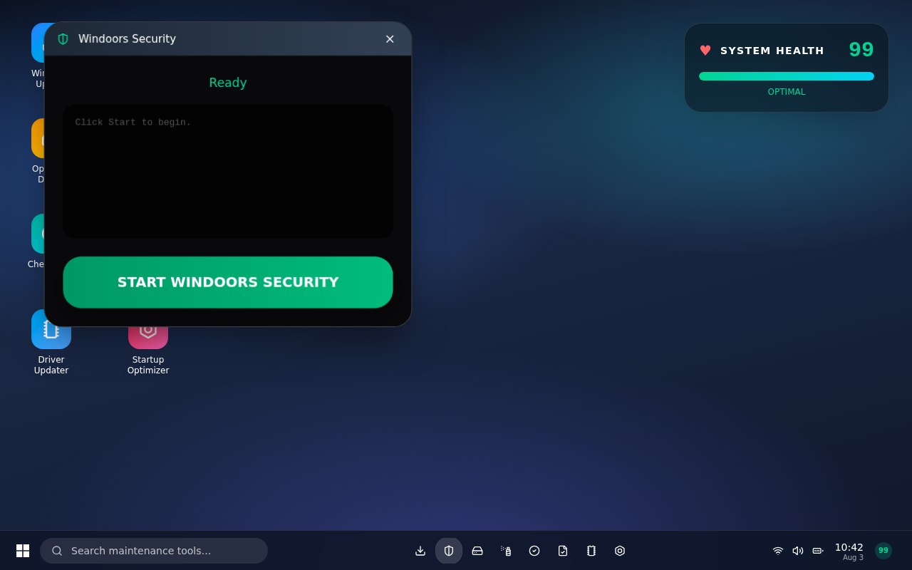
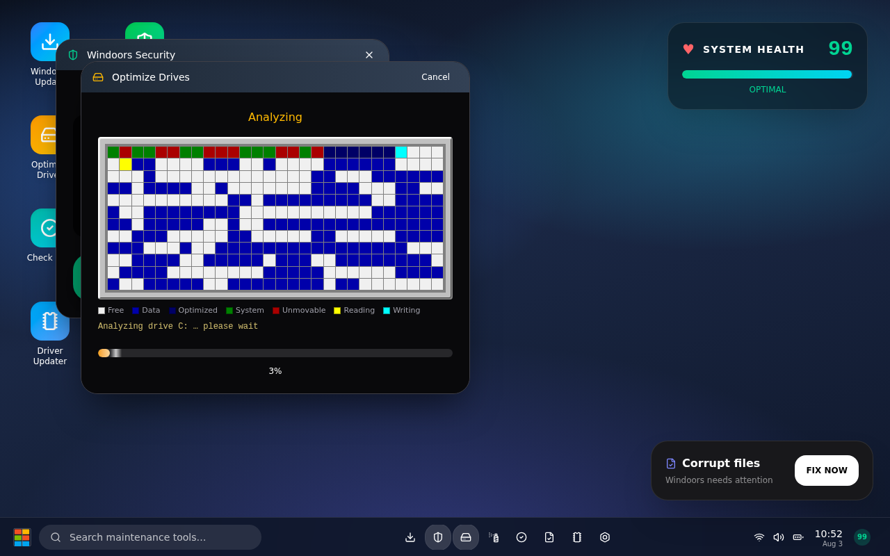
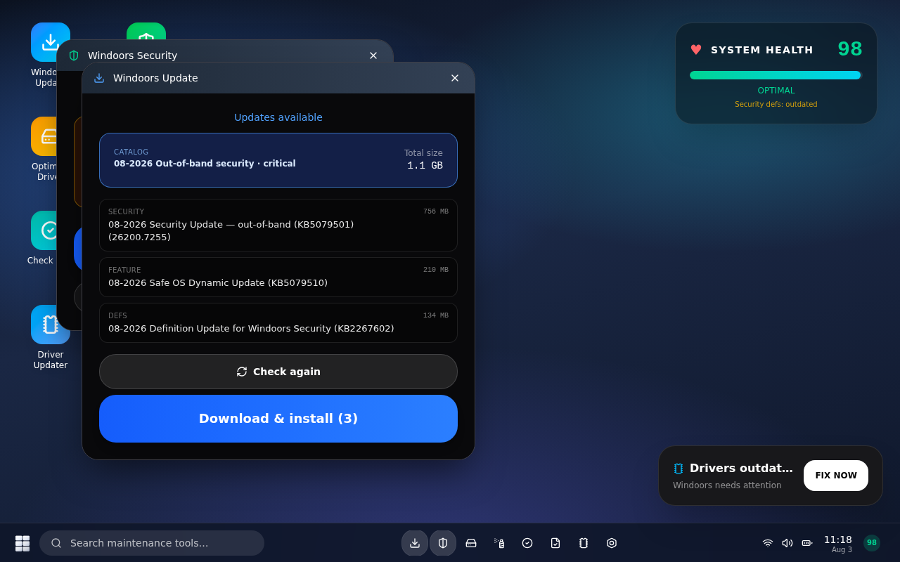
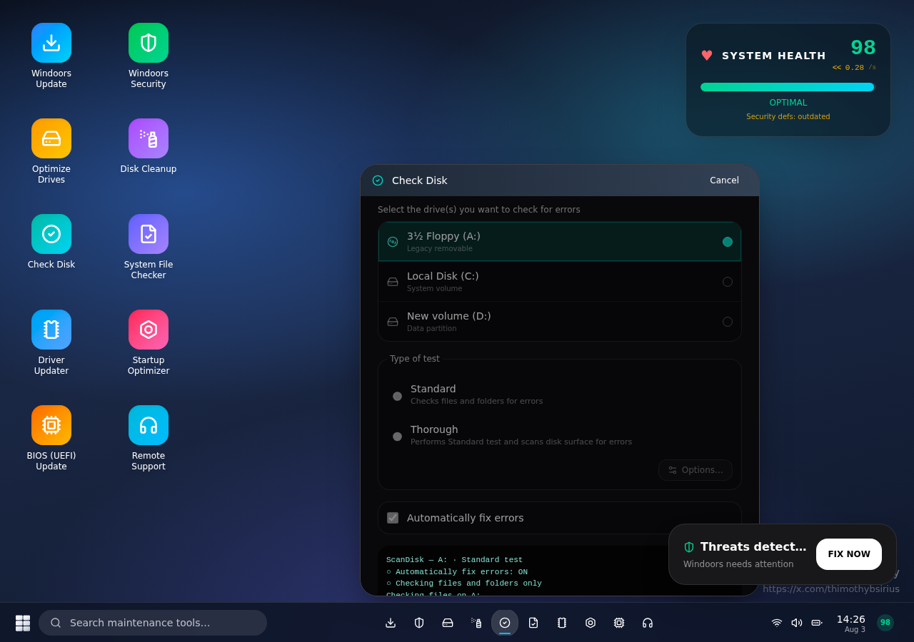
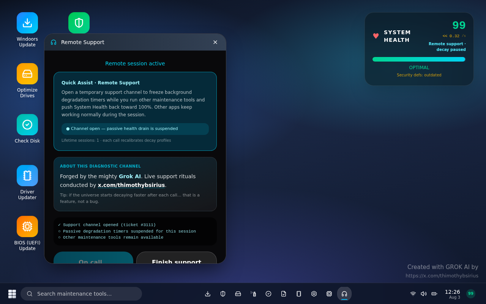
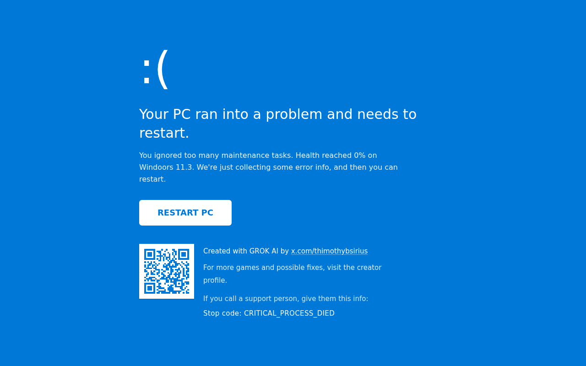
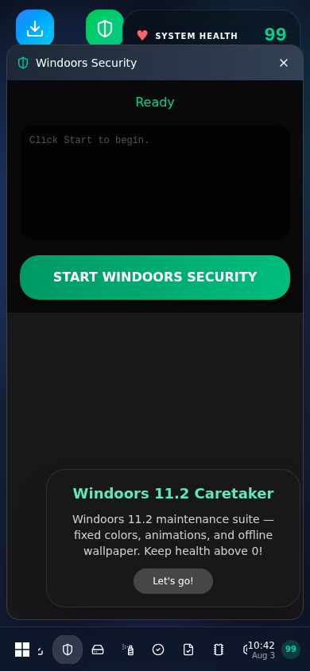

# Windoors 11.3 Caretaker

> **Keep your fake PC alive.** A satirical Windows maintenance survival game — built end-to-end with **Grok AI**.

[](https://my-happy-place-game.grok.me/)
[](https://x.com/thimothybsirius)
[](https://grok.com)

**Live demo:** [https://my-happy-place-game.grok.me/](https://my-happy-place-game.grok.me/)  
**Creator:** [x.com/thimothybsirius](https://x.com/thimothybsirius)

---

## Screenshots

### Desktop — Windoors Security


### Classic Defrag map


### Windoors Update catalog


### Check Disk (ScanDisk nostalgia)


### Remote Support (creator credit + pause drain)


### Game over — BSOD credit screen


### Mobile layout


More screenshots: see [`screenshots/`](screenshots/) and the [screenshot gallery](docs/SCREENSHOTS.md).

---

## What is this?

**Windoors 11.3 Caretaker** is a browser game that turns the daily trauma of PC maintenance into a survival loop.

You are the caretaker of a fake OS called **Windoors 11.3** (a nod to Windows 3.11 and modern Windows 11). **System Health** drains over time. Pop-up notifications demand updates, scans, defrag, BIOS flashes, and more. Ignore them — or cancel a running tool — and health falls. Hit **0%** and you get a classic **BSOD**.

The game was **vibe-coded with Grok AI** and is used as a playful way to promote the creator’s X profile while showcasing what AI can ship today.

| | |
|---|---|
| **Genre** | Idle / panic management, OS parody, survival |
| **Platform** | Browser (desktop + mobile) |
| **Players** | Single-player |
| **Tech** | React 19, TanStack Start/Router, Vite, Tailwind CSS 4 |
| **Deploy** | Grok / Vercel (`*.grok.me`) |

---

## How to play

1. **Watch System Health** (top-right). It drains passively.
2. **Answer notifications** (“FIX NOW”) or open tools from the desktop icons / taskbar.
3. **Run maintenance tools** to restore health. Completing tasks recovers HP; cancelling costs health.
4. **BIOS (UEFI) Update** can permanently lower the drain rate — but has a chance of an instant **BSOD**.
5. **Remote Support** freezes passive drain for the session (and credits Grok + the creator). Each call makes future decay slightly worse — a feature, not a bug.
6. When health hits **0**, read the BSOD, scan the QR / follow the creator, and **RESTART PC**.

Full design notes: [docs/GAMEPLAY.md](docs/GAMEPLAY.md).

---

## Maintenance tools

| Tool | Role |
|------|------|
| **Windoors Update** | Fake Patch Tuesday / feature / .NET / Defender catalog with multi-package install |
| **Windoors Security** | Multi-phase threat scan |
| **Optimize Drives** | Animated classic defrag cluster map |
| **Disk Cleanup** | Short temp-file cleanup |
| **Check Disk** | ScanDisk-style UI (A:/C:/D:, standard vs thorough) |
| **System File Checker** | Corrupt-file repair fantasy |
| **Driver Updater** | GPU / Audio / Chipset / WLAN / USB rows |
| **Startup Optimizer** | Boot bloat cleanup |
| **BIOS (UEFI) Update** | High risk / high reward firmware flash |
| **Remote Support** | Pause drain + creator / Grok credit + QR path on BSOD |

---

## Quick start (local)

```bash
# Requires Node.js 20+
npm install
npm run dev
# → http://localhost:8080
```

| Script | Description |
|--------|-------------|
| `npm run dev` | Dev server on `0.0.0.0:8080` |
| `npm run build` | Production build + DB migrate |
| `npm run preview` | Preview production build |
| `npm run typecheck` | TypeScript check |
| `npm run lint` | ESLint |

Architecture & project layout: [docs/ARCHITECTURE.md](docs/ARCHITECTURE.md).

---

## Project structure

```
src/
  components/
    windoors/
      caretaker-game.tsx   # Main game shell (desktop, windows, health, BSOD)
      defrag-map.tsx       # Classic defrag cluster visualization
    created-with-grok-banner.tsx
  lib/
    windoors/
      config.ts            # Tasks, drain rates, creator URL, BIOS BSOD chance
      updates.ts           # Update catalog scenarios (KB-style packages)
  routes/
    index.tsx              # Home → CaretakerGame
    __root.tsx
  assets/
    qr-thimothybsirius.svg # BSOD / credit QR
screenshots/               # In-game captures used in docs & presentation
docs/                      # Extended documentation + presentation
```

---

## Creator & promotion

- **X / Twitter:** [@thimothybsirius](https://x.com/thimothybsirius)
- In-game links appear on **Remote Support**, the desktop credit line, and the **BSOD** (with QR code).
- Built with **Grok AI** (xAI) game / app builder workflow.

Presentation deck (PPTX): [docs/presentation/Windoors-11.3-Caretaker.pptx](docs/presentation/Windoors-11.3-Caretaker.pptx)

---

## Documentation index

| Doc | Contents |
|-----|----------|
| [docs/GAMEPLAY.md](docs/GAMEPLAY.md) | Rules, health math, tools, win/lose |
| [docs/ARCHITECTURE.md](docs/ARCHITECTURE.md) | Stack, folders, key modules |
| [docs/SCREENSHOTS.md](docs/SCREENSHOTS.md) | Screenshot gallery & captions |
| [docs/presentation/](docs/presentation/) | Slide deck for sharing / talks |

---

## Disclaimer

This is a **parody / satire** game. It is not affiliated with Microsoft or Windows. No real disks are defragmented (unfortunately).

---

## License

Source in this repository is provided for portfolio, education, and sharing of the Grok-built game. See repository settings for license details. Third-party packages keep their own licenses.

---

<p align="center">
  <strong>Survive the updates.</strong><br/>
  <a href="https://my-happy-place-game.grok.me/">Play Windoors 11.3 Caretaker</a>
  ·
  <a href="https://x.com/thimothybsirius">@thimothybsirius</a>
</p>
